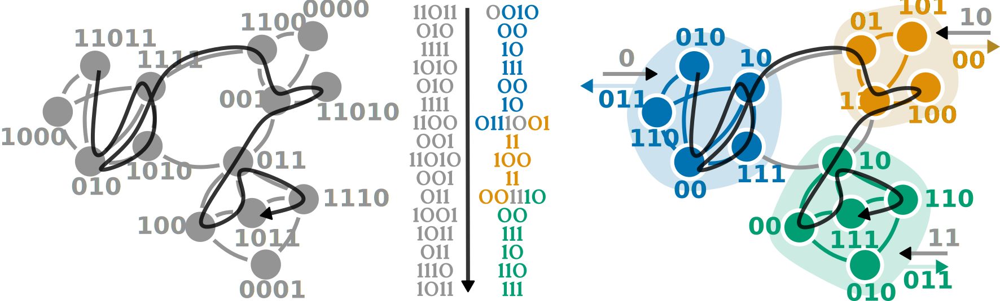
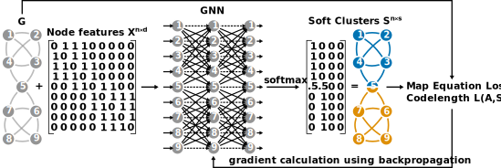

# Neuromap
Companion repository for the paper **The Map Equation Goes Neural: Mapping Network Flows with Graph Neural Networks** by Christopher Blöcker, Chester Tan, and Ingo Scholtes, to appear at NeurIPS 2024.
The paper adapts the map equation, an information-theoretic objective function for community detection, as a loss function for detecting communities with (graph) neural networks.

## How the map equation works
The map equation is an information-theoretic objective function for community detection in complext networks.
The map equation adopts a compression perspective and quantifies how efficiently a random walk on a network can be described based on the given communities.
Those communities that lead to the best compression are considered to describe the organisational structure of the network well.
The map equation's basic principles are described in the paper; more detailed explanations can be found in [Community Detection with the Map Equation and Infomap: Theory and Applications](https://arxiv.org/abs/2311.04036).

The basic princple goes like this: (1) split the network into communities; (2) assign codewords to the nodes that are unique within each community, for example using Huffman codes; (3) compute how many bits are required per step that a random walker takes on the network -- this is the so-called codelength. The lower the codelength, the better the partition from step (1).
**In practice** no codewords or random walks are used, instead, the map equation computes the codelength analytically.




## How Neuromap works
"Neuromap" refers to using the map equation as a loss function in combination with (graph) neural networks to learn (soft) cluster assignmants (communities).
The figure below shows the general setup, where the input consists of a graph, and the output is a soft cluster assignment matrix, optimised in an unsupervised fashion by minimising the map equation through gradient descent.



The core component is the (two-level) map equation, which can be expressed as follows in python, using `torch`:

```python
# map equation loss function
def L(S: torch.tensor, F: torch.tensor, p: torch.tensor) -> float:
    """
    Computes the codelength, L, as defined by the map equation.

    Parameters
    ----------
    S: A soft cluster assignment matrix.

    F: The network's flow matrix.

    p: A vector with the nodes' visit rates.

    Returns
    -------
    The codelength for the given soft clusters on the network with the given
    flow matrix and node visit rates.
    """
    C      = S.T @ F @ S
    diag_C = torch.diag(C)

    q      = 1.0 - torch.trace(C)
    q_m    = torch.sum(C, dim = 1) - diag_C
    m_exit = torch.sum(C, dim = 0) - diag_C
    p_m    = q_m + torch.sum(C, dim = 0)

    codelength = torch.sum(q      * torch.nan_to_num(torch.log2(q),      nan = 0.0)) \
               - torch.sum(q_m    * torch.nan_to_num(torch.log2(q_m),    nan = 0.0)) \
               - torch.sum(m_exit * torch.nan_to_num(torch.log2(m_exit), nan = 0.0)) \
               - torch.sum(p      * torch.nan_to_num(torch.log2(p),      nan = 0.0)) \
               + torch.sum(p_m    * torch.nan_to_num(torch.log2(p_m),    nan = 0.0))

    return codelength
```

The self-contained `example-usage.py` notebook is intended to provide a minimal example as a starting point.

## Requirements
To run the code in this repository, you will need a couple of libraries.
Since the _exact_ setup varies somewhat depending on the available hardware (GPU available or not?), please refer to the documentation of the respective library.
* [PyTorch](https://pytorch.org/)
* [PyG](https://pytorch-geometric.readthedocs.io/en/latest/)
* [PyTorch Geometric Signed Directed](https://pytorch-geometric-signed-directed.readthedocs.io/en/latest/index.html)
* [Open Graph Benchmark (OGB)](https://ogb.stanford.edu/)
* The implementation of [NOCD](https://github.com/shchur/overlapping-community-detection), a baseline that is used in the experiments
* Infomap as a baseline, which is available as the python package `infomap`
* Some "standard" python libraries: `matplotlib`, `seaborn`, `scikit-learn`, `networkx`
* Some synthetic LFR networks that are [available here]() (generated with code [available here](https://sites.google.com/site/andrealancichinetti/benchmarks))
* The results of our experiments can be found [here]()

Or perhaps you are just interested in looking at the results, which are included in the notebooks.

## Citation
If you're using Neuromap, please cite \
(Citation entry for the NeurIPS version is coming as soon as it becomes available...)
```bibtext
@misc{blöcker2024mapequationgoesneural,
  title         = {The Map Equation Goes Neural: Mapping Network Flows with Graph Neural Networks},
  author        = {Christopher Bl\"cker and Chester Tan and Ingo Scholtes},
  year          = {2024},
  publisher     = {arXiv},
  doi           = {10.48550/arXiv.2310.01144},
  url           = {https://doi.org/10.48550/arXiv.2310.01144},
  eprint        = {2310.01144},
  archivePrefix = {arXiv},
  primaryClass  = {cs.LG},
  howpublished  = {\href{https://doi.org/10.48550/arXiv.2310.01144}{arXiv:2310.01144}}
}
```